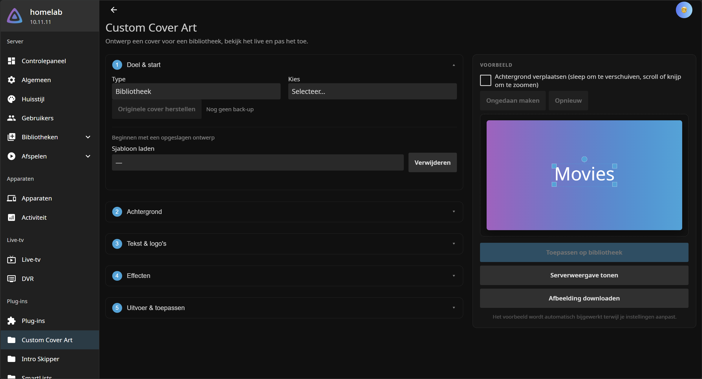
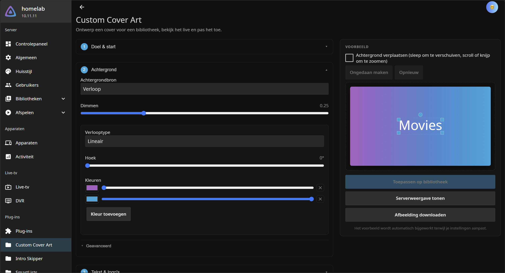
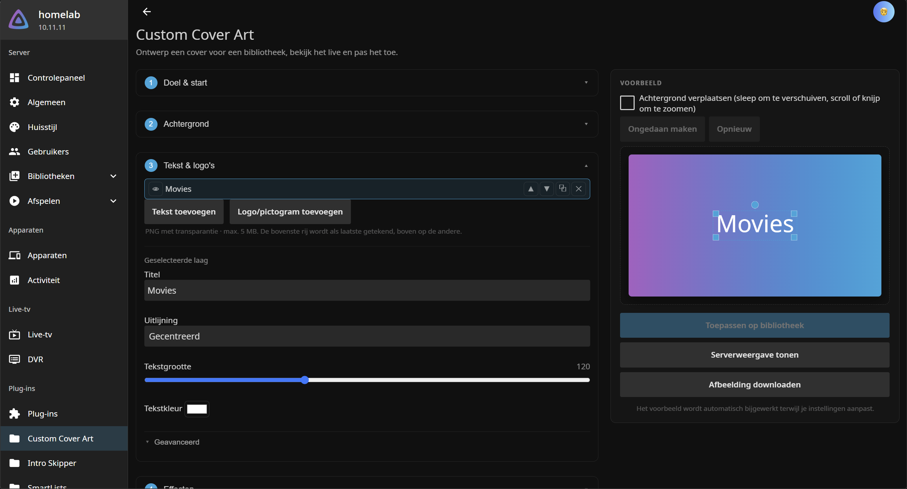
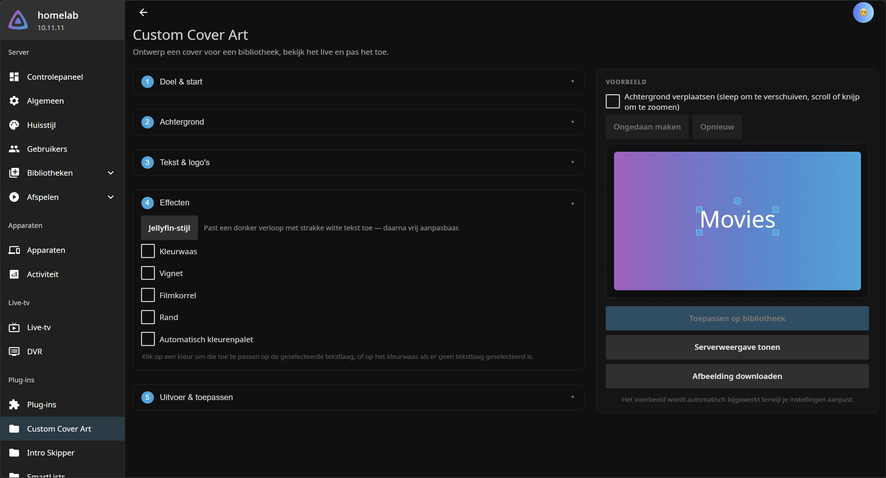
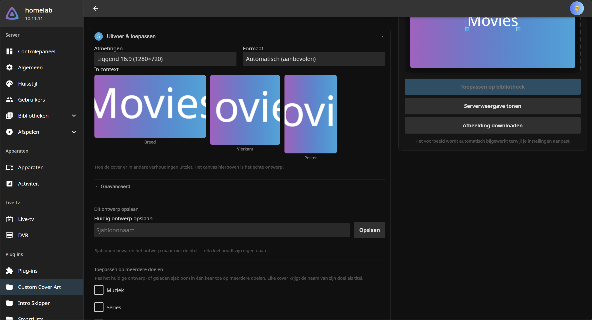
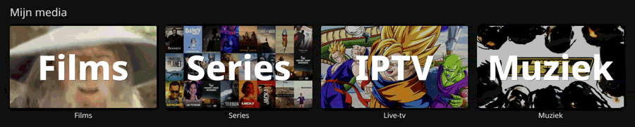

<div align="center">

# 🎨 Custom Cover Art

**A Jellyfin plugin for designing and applying custom cover art to your media libraries.**

Layered text and logos, backgrounds, composition effects — designed on a live canvas, right inside the Jellyfin dashboard.

`Jellyfin 10.11` · `.NET 9` · `SixLabors.ImageSharp`

</div>

---

> ### 🤖 AI assistance disclaimer
>
> This plugin was substantially rebuilt and refactored with the help of an AI assistant
> (Anthropic's Claude). The code **compiles cleanly and passes an automated unit-test suite**
> covering rendering, the client/server parity contracts, upload validation, the path-traversal
> sandbox, config-page structure and translation completeness — and the runtime paths have been
> tested against a live Jellyfin server.

---

## ✨ Features

| | Feature | Details |
|---|---|---|
| 🅰️ | **Text overlays** | Any number of text layers, each with its own size, weight, colour and alignment |
| 🖼️ | **Logo & icon layers** | Drop your own PNGs onto the cover — positioned, resized, rotated and faded independently |
| 🗂️ | **Layers panel** | Show/hide, reorder, duplicate, delete and select every layer; the editor follows your selection |
| 🌑 | **Text effects** | Drop shadow and outline for readability over busy backgrounds |
| 🌈 | **Gradients** | Linear and radial gradient backgrounds |
| 🌗 | **Overlay gradient** | Fade a colour in over any background, under your text — each stop with its own opacity, plus one-click presets |
| 🖼️ | **Custom backgrounds** | Upload your own image, or pick an existing poster from any library |
| 🌫️ | **Blur & dimming** | Soften and darken backgrounds so text stands out |
| ✨ | **Composition effects** | Colour wash, vignette, film grain and a square/rounded border — single or double-lined |
| 🎨 | **Auto palette** | Pulls the dominant colours out of your background as clickable swatches |
| ⚡ | **Jellyfin-style preset** | One click for the familiar dark-gradient look, editable afterwards |
| 🧭 | **Guided steps** | Five numbered steps, essentials up front and advanced controls one click away |
| ↩️ | **Undo / redo** | Ctrl+Z and Ctrl+Y across the whole design |
| 📱 | **Mobile-friendly** | Large touch targets, sticky preview, full-screen poster browser, grabbable canvas handles |
| 🔍 | **In-context preview** | See the cover wide, square and poster-shaped before applying |
| 🔠 | **Fonts** | Bundled Noto Sans (matches Jellyfin's UI, so text always renders) — or upload your own `.ttf` / `.otf` / `.ttc` / `.woff` / `.woff2`, which the live canvas renders too |
| 📐 | **Presets & sizes** | Landscape 16:9 (the default), square cover, portrait poster, wide banner, or custom dimensions |
| 🖱️ | **Interactive canvas** | The preview is a live canvas — drag layers to position them, resize/rotate them with handles, drag/scroll/pinch to reposition and zoom the background |
| 🎯 | **Authoritative server render** | The canvas is a fast approximation; "Show server render" renders the exact same design on the server before you apply |
| 🧩 | **Poster collage** | Auto-build a grid-mosaic background from a target's own item posters |
| 💾 | **Design templates** | Save a look and reuse it; each target keeps its own name as the title |
| 📚 | **Batch apply** | Apply one design to many libraries/collections/playlists at once |
| 🕗 | **Restore original** | One-click revert to a target's pre-plugin cover |
| 🎞️ | **Animated GIF** | Export animated covers (animated-source passthrough or Ken Burns pan/zoom) |
| 🌍 | **Localisation** | English, Dutch and Spanish included; easy to add more |
| 🪶 | **Lightweight** | Small footprint — the plugin DLL is ~1.8 MB (fonts are subset-embedded), so it stays easy on the server |

## 📸 Screenshots

*Taken with the Dutch UI — the page follows your Jellyfin display language, so it appears in
English by default.*

<div align="center">



*Step 1 — Target & start*

</div>

<details>
<summary><b>The other four steps</b></summary>

<div align="center">



*Step 2 — Background*



*Step 3 — Text & logos*



*Step 4 — Effects*



*Step 5 — Output & apply*

</div>

</details>

<div align="center">



*An example of what you can make — an animated cover*

</div>

## 📋 Requirements

- **Jellyfin Server 10.11.x** (the plugin is ABI‑locked to this major version)
- The **.NET 9 SDK** — only needed if you build from source; the runtime ships with Jellyfin

## 🚀 Installation

### Via the plugin repository (recommended)

This installs the plugin from within Jellyfin and keeps it updated automatically.

1. In Jellyfin, go to **Dashboard → Plugins → Repositories → `+`**.
2. Add a repository:
   - **Name:** `Custom Cover Art`
   - **URL:**
     ```
     https://raw.githubusercontent.com/Bardesss/customcoverart/main/manifest.json
     ```
3. Go to **Dashboard → Plugins → Catalog**, find **Custom Cover Art** under *General*, and install it.
4. **Restart** the Jellyfin server when prompted.

### From a built DLL (manual)

1. Build the plugin (see below) or download a release `CustomCoverArt.dll`.
2. In your Jellyfin **data directory**, create a folder:
   `plugins/CustomCoverArt/`
   *(e.g. `/var/lib/jellyfin/plugins/CustomCoverArt/` on Linux, or
   `%ProgramData%\Jellyfin\Server\plugins\CustomCoverArt\` on Windows).*
3. Copy `CustomCoverArt.dll` **and the bundled `SixLabors.*.dll` files** into that folder.
4. Restart the Jellyfin server.
5. Open **Dashboard → Plugins** and confirm *Custom Cover Art* is listed and active.

## 🛠️ Building from source

```bash
dotnet restore
dotnet build -c Release
```

The output is in `bin/Release/net9.0/`. Copy `CustomCoverArt.dll` plus the
`SixLabors.ImageSharp*.dll` and `SixLabors.Fonts.dll` files into the plugin folder above.
*(The `Jellyfin.*` assemblies are provided by the server and are intentionally **not** shipped.)*

## 🎬 Usage

Go to **Dashboard → Plugins → Custom Cover Art**. The page walks through five numbered steps.
Nothing is locked — open any step at any time, and only one stays open so the page never becomes
a wall of controls. Each step shows what most people need, with the rest under **Advanced**.

1. **Target & start** — pick a library, collection, playlist or Live TV. Optionally start from a
   saved template, or restore the target's original cover.
2. **Background** — choose one source: an **image** (upload one or browse your library's posters),
   a **poster collage** built from the target's own items, a **gradient**, or a **solid colour**.
   Only the chosen source's controls are shown.
3. **Text & logos** — stack as many text layers and PNG logos as you like; see *Text and logo
   layers* below.
4. **Effects** — colour wash, vignette, film grain and a border, plus the Jellyfin-style preset
   and Auto palette.
5. **Output & apply** — size and format, a preview of the cover **in context** at other shapes,
   then Apply or Download. Saving a template and batch-applying live under Advanced here.

While you work, the canvas on the right (top, on a phone) updates live. Click a layer and **drag**
it to reposition, or use its corner handles to resize and the knob to rotate. Toggle **Reposition
background** to drag-pan the background image and scroll or pinch to zoom it — up to 4×. With the
**Fill** image fit you can pan straight away to choose which part of the picture the cover shows;
**Fit** and **Stretch** show the whole image already, so there is nothing to pan into until you
zoom in. **Ctrl+Z** and **Ctrl+Y** undo and redo anything.

Before applying, **Show server render** produces the exact server-rendered output — the canvas is
a fast approximation and the server render is authoritative.

### Text and logo layers

**Add text** stacks another independently styled text layer; **Add logo/icon** uploads a PNG
(transparency preserved) as an image layer. The Layers list shows the top-most layer first — use
▲/▼ to restack, 👁 to hide a layer without deleting it, ⧉ to duplicate and ✕ to remove. Click any
row to select it; the **Selected layer** section below edits that layer, and text-only controls
hide when a logo is selected. On a narrow screen those actions sit behind the row's **⋯** button,
so tapping anywhere else on the row simply selects it.

On the canvas the selected layer gets **corner handles** (drag to resize — a logo scales about its
centre, text scales its font size) and a **knob above it to rotate**. Hold **Shift** while dragging
to keep a logo's proportions, or while rotating to snap to 15° steps. The **Opacity** and
**Rotation** sliders apply to text and logos alike. Covers are capped at 40 layers.

### Using an existing poster as a background

Open **Browse library posters**, search/filter your media, and click any item. Its poster is
copied into the plugin's own data folder and used as the background — a safe, sandboxed copy,
never a direct reference to your media files.

### Effects and colours

Step 4 holds four composition effects, each off until you tick it: a **colour
wash** that tints everything under your layers, a **vignette** that darkens toward the edges, **film
grain**, and a **border** with optional rounded corners and a second inner line. Sliding an effect
back to zero restores the cover exactly — nothing is baked in.

**Jellyfin style** applies the familiar default look (dark vertical gradient, clean white bold
centred text) as an ordinary starting point you can keep editing. It clears any background image,
since the gradient is the point.

**Overlay gradient** (step 2, under Dimming) fades a colour in over the background and under your
layers — the look where a poster resolves into a solid band of colour with the title sitting on top
of it. Every colour stop carries its own **opacity**, so a fade can run from fully transparent to
fully solid, use two colours for a duotone, or wash the whole cover evenly. Four presets — **Bottom
fade**, **Top fade**, **Full wash** and **Duotone** — set it up in one click, and switching between
them keeps the colours you have already chosen, so you can try all four without losing your palette.
The angle is under **Advanced**. It works over every background type, including poster collages and
animated covers.

**Auto palette** samples the dominant colours from your background and shows them as swatches.
Click one to recolour the overlay-gradient stop you last touched, when the overlay is on and one of
its stops has focus — otherwise the selected text layer, falling back to the colour wash. It runs
entirely in your browser — nothing is uploaded — and stays off until you enable it.

> Film grain is the one effect where the preview is an approximation: the canvas scales a noise
> tile for speed, while the server draws true per-pixel noise. Use **Show server render** to see
> the exact result.

### Poster-collage backgrounds

In step 2, set **Background source** to *Poster collage from this target* to build a
dimmed grid of that library's own posters. Use **Shuffle** to re-roll the arrangement. (Live TV
has no posters, so collage is unavailable there.)

### Templates and batch apply

Design a cover, then **Save this design** under **Advanced** in step 5. **Apply to several
targets**, in the same place, applies your design (or a saved template) to many libraries at once —
each cover titled with its target's own name. To start from a saved design, pick it in step 1. Templates saved before the canvas editor still load fine —
they're migrated to the new design format automatically the first time you pick them.

### Animated covers

Set the output format to **Animated GIF** to export a moving cover — either passing through an
animated-GIF background, or applying a gentle **Ken Burns** pan/zoom. GIFs are larger and only
animate in the Jellyfin views that render GIFs.

### Restoring the original

Applying a cover automatically backs up the target's previous image once. Use **Restore original
cover** in step 1 to revert.

## 🔒 Security & privacy

- All endpoints require an authenticated **administrator** (`RequiresElevation` policy).
- Uploads are **rate‑limited**, size‑capped, and validated by **content** (not just extension) —
  executables and non‑image payloads are rejected even if renamed to `.png`.
- Background, font and layer-image paths supplied by the browser are **sandboxed** to the
  plugin's data directory, so the generator cannot be pointed at arbitrary files on the server.
- Uploaded files are stored under Jellyfin's data path using randomised names.
- The number of layers per cover is **capped at 40** server-side, so a crafted request cannot
  turn one render into unbounded work.

## 🌐 Adding a translation

Strings live in **two** places, and a language needs both — translating only the first
leaves the whole configuration page in English.

**1. Server messages** — `Resources/<language-code>.json`. A short file: the six upload
and validation errors the server returns.

1. Copy `Resources/en.json` as a starting point.
2. Translate the values; keep the keys identical.
3. Use `{0}`, `{1}` for interpolated values (e.g. `"File is too large. Maximum {0}MB."`).
4. Add the language code to `LocalizationService.SupportedLanguageCodes`.
5. Detection order: `JELLYFIN_LANGUAGE` → `LANG` → system culture → English fallback.
   Note this is the **server's** locale, not the browser's — the two can disagree.

**2. The configuration page** — the `I18N` object near the top of the `<script>` block in
`Configuration/configPage.html`. This is by far the larger of the two and covers every
label, button and hint you see in the dashboard. Add a block alongside `en`, `nl` and
`es`, keyed by the two-letter language code; the page picks it from Jellyfin's stored UI
language. Regional codes fold to the base language, so `es-MX` and `es-419` both use `es`.

Then rebuild — five guards fail the build before a half-finished translation can ship:

| Test | Catches |
|---|---|
| `EveryI18nKeyUsedInMarkup_ExistsInEveryLanguage` | a `data-i18n` key missing from a language |
| `EveryLanguage_DefinesTheSameKeysAndPlaceholdersAsEnglish` | key drift and `{0}`/`{1}` mismatches vs `en` |
| `EveryDefinedI18nKey_IsReachableFromTheMarkupOrScript` | strings left behind that nobody has to translate |
| `EverySupportedLanguage_HasTheSameKeysAndPlaceholdersAsEnglish` | the same two checks for `Resources/*.json` |
| `EveryKeyTheServerCodeUses_ResolvesToRealText` | a key the server asks for that no longer exists |

Included: `en` (English), `nl` (Dutch), `es` (Spanish).

## 🧪 Development

```bash
dotnet test tests/CustomCoverArt.Tests
```

The suite covers rendering (backgrounds, layers, effects, and the client/server parity
contracts), upload validation, the path-traversal sandbox, document migration, plugin
wiring, and the configuration page's structure and translation completeness.

Because the plugin references the Jellyfin server assemblies with `ExcludeAssets=runtime`,
the test project references `Jellyfin.Common` / `Jellyfin.Controller` / `Jellyfin.Model`
directly to supply them at test time.

Two guards are worth knowing about before editing `Configuration/configPage.html`:
`ConfigPageStructureTests` pins every `cca*` element id, so a control cannot be silently
dropped while markup is moved — add new ids to that list. And the translation checks fail
the build if a `data-i18n` key in the markup is missing from any language, if a language
drifts out of key parity with `en`, or if a defined key stops being used at all.

### Jellyfin version compatibility

The Jellyfin package version lives in one place per project: `<JellyfinVersion>` in
`CustomCoverArt.csproj` and in the test project. Override it to build against a different
server release without editing anything:

```bash
dotnet test tests/CustomCoverArt.Tests -p:JellyfinVersion=10.11.11
```

The **Jellyfin compatibility** GitHub Action runs weekly (and on demand). It asks NuGet for
the newest `Jellyfin.Controller`, and if that is ahead of the pin it builds and runs the full
suite against it, opening a single `jellyfin-compat` issue if anything breaks — so a server
update that breaks the plugin shows up here rather than in someone's server log. A second,
advisory job does the same against the newest pre-release (currently the `12.0.0-rc` line)
and is allowed to fail: it is early warning, not a broken build.

Note that Jellyfin 12 targets `net10.0`, so the advisory job also retargets via
`-p:PluginTargetFramework=net10.0`. That check is compile-and-unit-test only — it says
nothing about whether the plugin still *loads* into a running server, and it deliberately
never touches `targetAbi` in `manifest.json`, which stays a human decision.

## 📦 Releasing

The version lives in one place: `<Version>` in `CustomCoverArt.csproj`. To ship a release,
bump it in a pull request and merge to `main`. The **Release** GitHub Action then builds the
plugin, publishes a GitHub release with the packaged zip, and appends the new version to
`manifest.json` — so servers subscribed to the repository auto-update. If the version has
already been released, the workflow is a no-op.

## 🧩 Project layout

| Path | Purpose |
|---|---|
| `Plugin.cs` | Plugin entry point (`BasePlugin` + `IHasWebPages`) |
| `PluginServiceRegistrator.cs` | DI registration (`IPluginServiceRegistrator`) |
| `Configuration/configPage.html` | The dashboard config UI — markup, styles, and the canvas engine (static, embedded) |
| `Controllers/` | REST API endpoints (`ControllerBase`, admin‑only) |
| `Models/CoverDocument.cs` | The layered design document shared by the client canvas and the server renderer |
| `Services/DocumentRenderer.cs` | The compositor: backgrounds, text and image layers |
| `Services/EffectsComposer.cs` | Composition effects (colour wash, vignette, grain, border) |
| `Services/` | Cover‑art generation, image processing, library/media access, etc. |
| `Common/PluginPaths.cs` | Data‑directory resolution and the path sandbox |
| `Resources/` | Server message translations and the bundled Noto Sans faces |
| `tests/CustomCoverArt.Tests/` | xUnit suite (`dotnet test`) |

## 🤝 Contributing

Contributions are welcome! If you hit a bug, have an idea, or want to add a feature or translation,
please [open an issue](https://github.com/Bardesss/customcoverart/issues) or send a pull request.
For larger changes, opening an issue first to discuss the approach is appreciated.

## 📄 License

[GPLv3](LICENSE) — Copyright © 2026 Bardesss.

Why GPLv3 and not something more permissive: this plugin is compiled against Jellyfin's shared
libraries (`Jellyfin.Controller` and `Jellyfin.Model`, both published under GPL‑3.0‑only) and is
loaded into the Jellyfin server process at runtime. The result is a combined work, so the plugin
inherits the same copyleft terms. Matching Jellyfin's licence keeps that unambiguous — and it also
satisfies the open‑source qualification of the Six Labors Split License, under which ImageSharp is
free to use.

## 🙏 Credits

- [**Jellyfin**](https://jellyfin.org/) — the media server platform this plugin extends.
- [**SixLabors ImageSharp**](https://github.com/SixLabors/ImageSharp) — image rendering and text drawing,
  licensed under the [Six Labors Split License 1.0](https://github.com/SixLabors/ImageSharp/blob/main/LICENSE)
  (free for open‑source projects such as this one; commercial use may require a paid licence).
- [**Noto Sans**](https://fonts.google.com/noto/specimen/Noto+Sans) by Google — bundled default font, licensed under the
  [SIL Open Font License 1.1](https://openfontlicense.org/).
